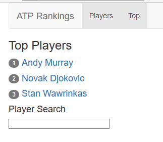
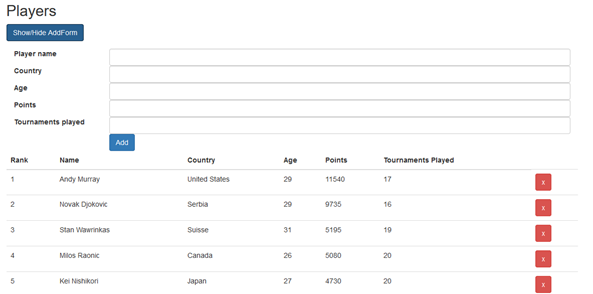
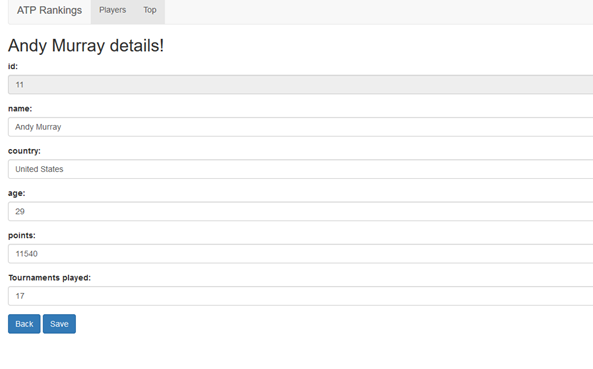

## OPDRACHT

Je gaat een applicatie ontwikkelen waarmee de gebruiker de lijst kan weergeven van de internationale professionele tennisspelers, en ook de mogelijkheid biedt om de top 3 weer te geven. Men zal ook naar een tennisspeler kunnen zoeken, zijn details zoals naam land enz. kunnen wijzigen, spelers toevoegen en verwijderen.

De navigatie wordt verzorgd door middel van routing. Alle operaties op spelers (lijst weergeven, verwijderen, …) gaan via http. Maak gebruik van de “angular-in-memory-web-api om een “spelers API” te simuleren.

Als je de applicatie in de browser oproept krijg je volgend scherm:

Het zijn de top 3 spelers gerangschikt volgen hun punten. Het menu Top brengt je naar dezelfde pagina.

De menu item Players geeft de volledige lijst van de spelers, gerangschikt volgens hun punten. Je ziet een knop Show/hide AddForm om een formulier weer te geven om een speler te kunnen toevoegen. Klikken op Add voegt deze speler toe aan de lijst.

Aan de hand van het kruisje in de laatste kolom kan men een speler verwijderen. De speler verdwijnt onmiddellijk uit de volledige lijst maar ook uit de Top3 indien van toepassing.

Als de gebruiker een speler klikt in deze lijst of in de top 3 lijst komt hij terecht op een pagina om de detailgegevens van deze speler te wijzigen.

Klikken op Back brengt ons een stap terug, dus naar de top3 lijst of de volledige lijst. Klikken op Save bewaart de wijzigingen. Deze wijzigingen zijn te zien in beide lijsten. Top 3 wordt eventueel aangepast indien het aantal punten gewijzigd is geweest. Ook hier worden de gegevens niet gecontroleerd vooraleer ze opgeslagen worden.

Zoals je op de schermafdrukken kan zien gebruiken we Bootstrap om de applicatie te stylen. Dit is echter volledig optioneel. Je aandacht moet gaan naar de functionaliteiten van de applicatie en de Angular code.

Moest je toch tijd over hebben en bootstrap willen gebruiken:

- De navigatie: we hebben onder andere gebruik gemaakt van het nav HTML element samen met divs en lijsten. Volgende classes zijn gebruikt: navbar navbar-default, navbar-header navbar-brand, container-fluid voor de breedte van de labels en inputs, etc Raadpleeg de Bootstrap documentatie.
- De top3 lijst maakt gebruik van spans met class badge
- Het formulier om de detailgegevens te wijzigen van een speler wordt opgebouwd met divs met class form-group en de knoppen hebben btn en btn-primary als class
- De lijst van de spelers:
    - Een knop met btn en btn-primary
    - In het input formulier:    
        - Divs met de form-group class
        - Inputs met met de form-control class
        - De breedte van de input en label tags gebruiken dan weer het bootstrap grid syteem met de col-sm-2 en col-sm-10 classes.

    - De lijst
        - Een table element met class table en table-hover
        - De knop om een speler te verwijderen is een a tag met class btn en btn-danger
    

